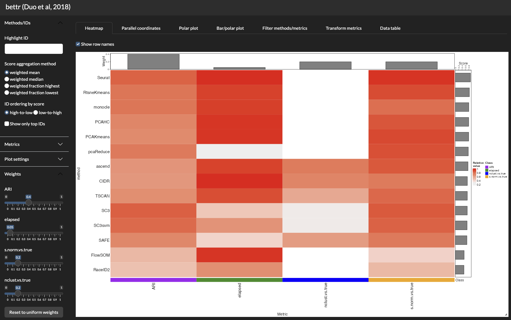
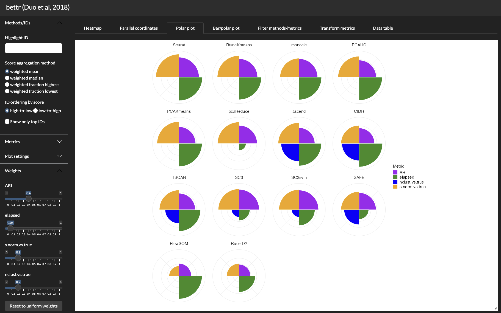

 

# `bettr`: a better way to explore what is best

 

<!-- badges: start -->

<!-- badges: end -->

As new methods come along, it becomes essential to compare them to existing ones with an objective and fair approach.

Apart from the benchmarking strategy itself, which can differ in function of the different procedures involved, we typically calculate many different performance measures, which we use to reflect different aspects. 
These can then be combined into one "overall" ranking. 
However, not all aspects are equally important to everyone, and thus there is more than one "right" way of ranking methods. 

`bettr` is our proposal to do this in an interactive way, using different types of visualization approaches, and enhancing the final overview of the benchmarking process.

The screenshots below display two of the representations provided by `bettr`, using data from the benchmark of single-cell clustering methods performed by [Duo et al (2018)](https://f1000research.com/articles/7-1141).

