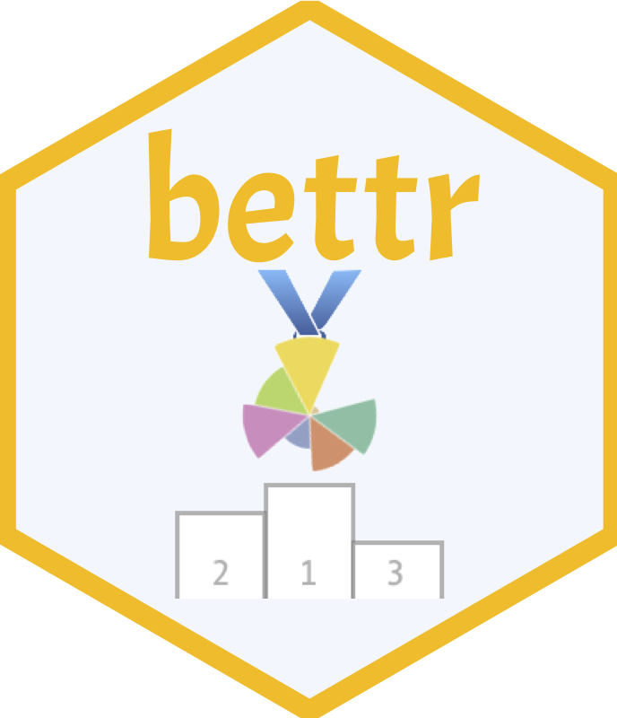
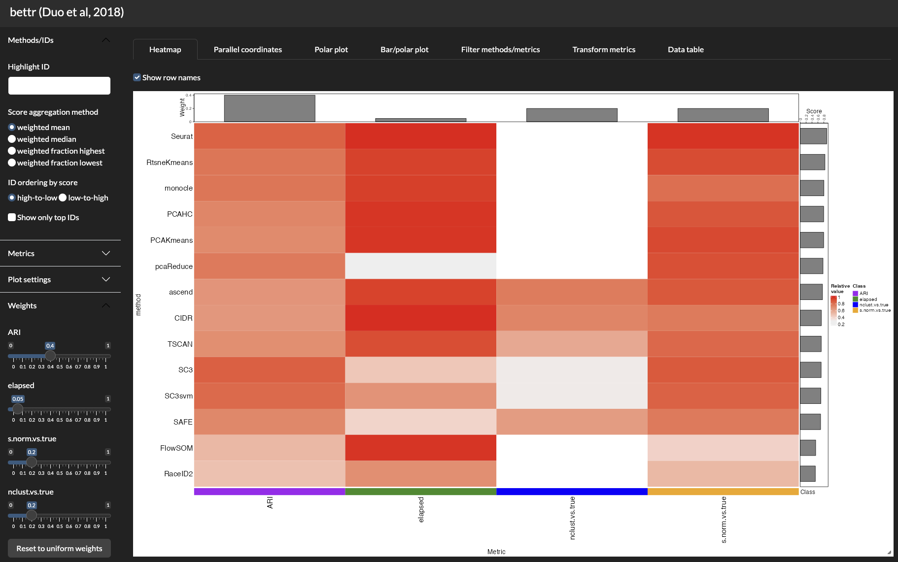
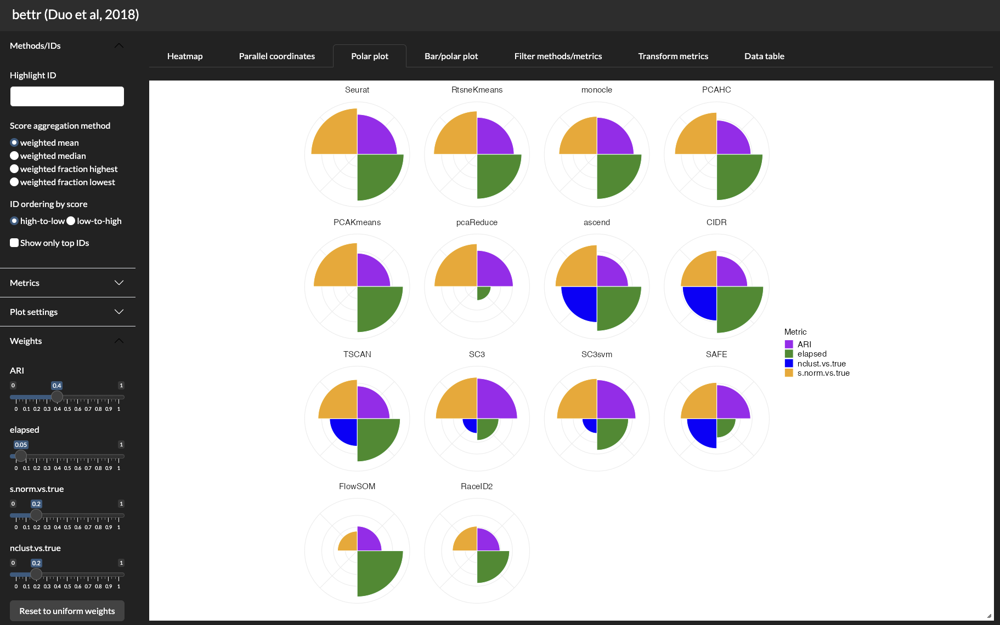

<br>

# `bettr`: a better way to explore what is best

<br>

## Quick links

* [Full documentation](https://federicomarini.github.io/bettr/articles/bettr.html)
* [Practical examples](https://github.com/csoneson/bettr-examples)

## Overview

As new (computational) methods come along, it becomes essential to compare 
their performance to existing ones via objective and fair benchmarking.

In a benchmarking study, typically many different performance metrics are
calculated and used to reflect different aspects of performance.
These performance metrics can then be combined into one "overall" ranking. 
However, not all aspects are equally important to everyone, and thus there is
more than one "right" way of aggregating metrics in order to rank methods. 

`bettr` is our proposal to perform this aggregation in an interactive way, 
allowing the user to focus on the aspects that are most important to them, 
and use different types of visualization approaches, enhancing the final 
overview of the benchmarking process.

The screenshots below display two of the representations provided by 
`bettr`, using data from the benchmark of single-cell clustering methods 
performed by [Duo et al (2018)](https://f1000research.com/articles/7-1141).




## Installation

`bettr` can be installed from Bioconductor (from release 3.19 onwards): 

``` r
if (!require("BiocManager", quietly = TRUE))
    install.packages("BiocManager")

BiocManager::install("bettr")
```

The latest development version can be installed from GitHub via 

```r
BiocManager::install("federicomarini/bettr")
```

## Usage

For more details on how to use `bettr`, we refer to the 
[vignette](https://federicomarini.github.io/bettr/articles/bettr.html).
If you have questions or run into problems, feel free to open an 
[issue](https://github.com/federicomarini/bettr/issues). Try to provide a 
reproducible example, and always include the code you used and your session 
info, that will make it much easier for us to help.

## Contributing to `bettr`

If you would like to contribute to `bettr`, you can do so by sending a pull 
request to this repository. If the contribution involves changes in the 
functionality provided by `bettr`, we encourage you to first open an issue to 
discuss the intended contribution.

<!-- badges: start -->
[](https://github.com/federicomarini/bettr/actions)
[](https://codecov.io/github/federicomarini/bettr)
<!-- badges: end -->
