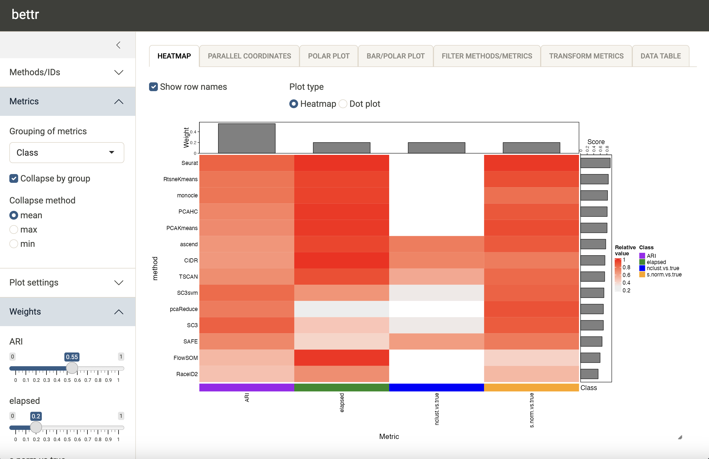
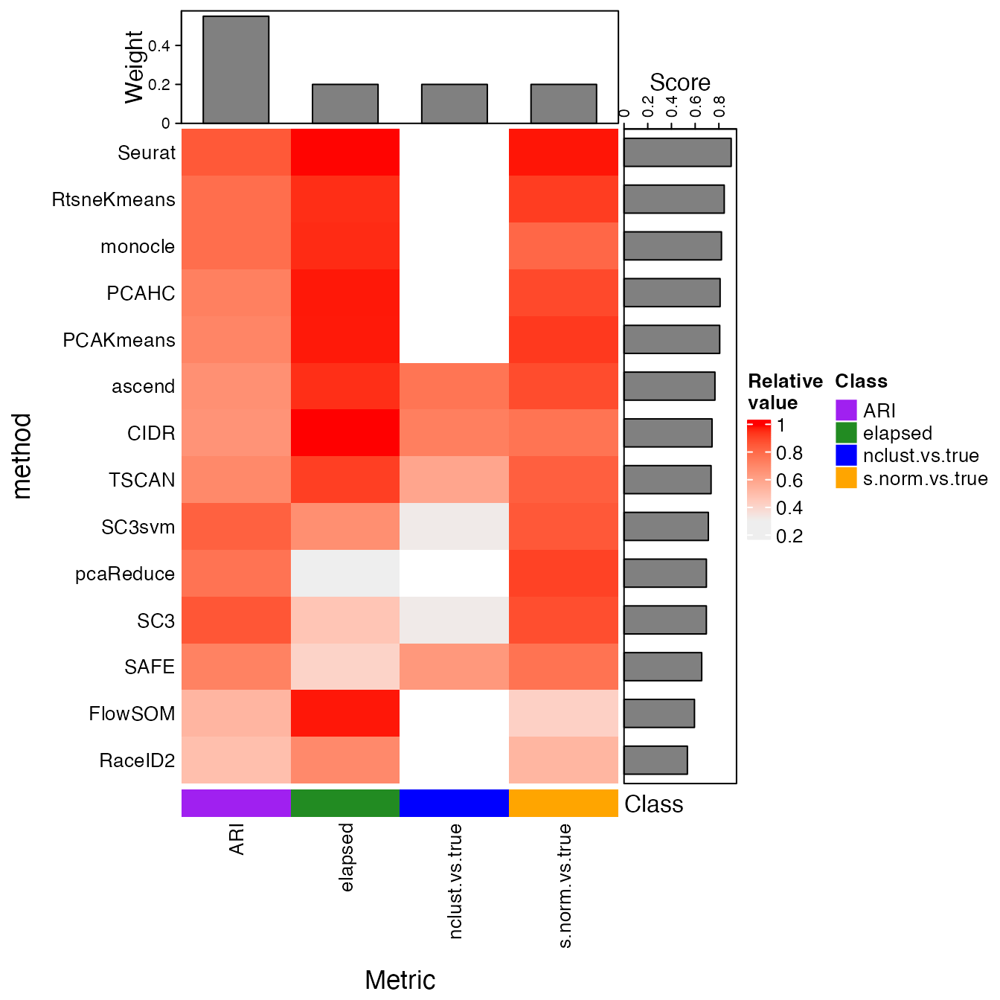
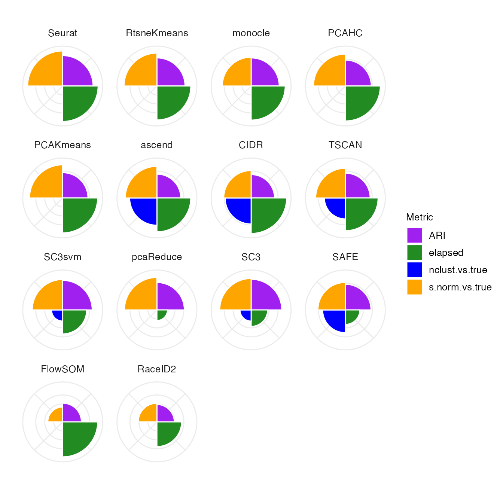

# bettr

## Introduction

Method benchmarking is a core part of computational biology research,
with an intrinsic power to establish best practices in method selection
and application, as well as help identifying gaps and possibilities for
improvement. A typical benchmark evaluates a set of methods using
multiple different metrics, intended to capture different aspects of
their performance. The best method to choose in any given situation can
then be found, e.g., by averaging the different performance metrics,
possibly putting more emphasis on those that are more important to the
specific situation.

Inspired by the [OECD ‘Better Life
Index’](https://www.oecdbetterlifeindex.org/#/11111111111), the `bettr`
package was developed to provide support for this last step. It allows
users to easily create performance summaries emphasizing the aspects
that are most important to them. `bettr` can be used interactively, via
a R/Shiny application, or programmatically by calling the underlying
functions. In this vignette, we illustrate both alternatives, using
example data provided with the package.

Given the abundance of methods available for computational analysis of
biological data, both within and beyond Bioconductor, and the importance
of careful, adaptive benchmarking, we believe that `bettr` will be a
useful complement to currently available Bioconductor infrastructure
related to benchmarking and performance estimation. Other packages
(e.g., *[pipeComp](https://bioconductor.org/packages/3.23/pipeComp)*)
provide frameworks for *executing* benchmarks by applying and recording
pre-defined workflows to data. Packages such as
*[iCOBRA](https://bioconductor.org/packages/3.23/iCOBRA)* and
*[ROCR](https://CRAN.R-project.org/package=ROCR)* instead provide
functionality for calculating well-established evaluation metrics. In
contrast, `bettr` focuses on *visual exploration* of benchmark results,
represented by the values of several evaluation metrics.

## Installation

`bettr` can be installed from Bioconductor (from release 3.19 onwards):

``` r
if (!require("BiocManager", quietly = TRUE))
    install.packages("BiocManager")

BiocManager::install("bettr")
```

## Usage

``` r
suppressPackageStartupMessages({
    library("bettr")
    library("SummarizedExperiment")
    library("tibble")
    library("dplyr")
})
```

The main input to `bettr` is a `data.frame` containing values of several
metrics for several methods. In addition, the user can provide
additional annotations and characteristics for the methods and metrics,
which can be used to group and filter them in the interactive
application.

``` r
## Data for two metrics (metric1, metric2) for three methods (M1, M2, M3)
df <- data.frame(Method = c("M1", "M2", "M3"),
                 metric1 = c(1.0, 2.0, 3.0),
                 metric2 = c(3.0, 1.0, 2.0))

## More information for metrics
metricInfo <- data.frame(Metric = c("metric1", "metric2", "metric3"),
                         Group = c("G1", "G2", "G2"))

## More information for methods ('IDs')
idInfo <- data.frame(Method = c("M1", "M2", "M3"),
                     Type = c("T1", "T1", "T2"))
```

To simplify handling and sharing, the data can be combined into a
`SummarizedExperiment` object (with methods as rows and metrics as
columns) as follows:

``` r
se <- assembleSE(df = df, idCol = "Method", metricInfo = metricInfo,
                 idInfo = idInfo)
se
#> class: SummarizedExperiment 
#> dim: 3 2 
#> metadata(1): bettrInfo
#> assays(1): values
#> rownames(3): M1 M2 M3
#> rowData names(2): Method Type
#> colnames(2): metric1 metric2
#> colData names(2): Metric Group
```

The interactive application to explore the rankings can then be launched
by calling the
[`bettr()`](https://federicomarini.github.io/bettr/reference/bettr.md)
function. The input can be either the assembled `SummarizedExperiment`
object or the individual components.

``` r
## Alternative 1
bettr(bettrSE = se)

## Alternative 2
bettr(df = df, idCol = "Method", metricInfo = metricInfo, idInfo = idInfo)
```

## Example - single-cell RNA-seq clustering benchmark

Next, we show a more elaborate example, visualizing data from the
benchmark of single-cell clustering methods performed by [Duo et al
(2018)](https://f1000research.com/articles/7-1141). The values for a set
of evaluation metrics applied to results obtained by several clustering
methods are provided in a `.csv` file in the package:

``` r
res <- read.csv(system.file("extdata", "duo2018_results.csv",
                            package = "bettr"))
dim(res)
#> [1] 14 49
tibble(res)
#> # A tibble: 14 × 49
#>    method      ARI_Koh ARI_KohTCC ARI_Kumar ARI_KumarTCC ARI_SimKumar4easy
#>    <chr>         <dbl>      <dbl>     <dbl>        <dbl>             <dbl>
#>  1 CIDR          0.672      0.805     0.989        0.977             1    
#>  2 FlowSOM       0.699      0.855     0.512        0.563             1    
#>  3 PCAHC         0.869      0.891     1            1                 1    
#>  4 PCAKmeans     0.836      0.903     0.989        0.978             1    
#>  5 RaceID2       0.280      0.276     0.949        1                 0.644
#>  6 RtsneKmeans   0.966      0.967     0.989        1                 1    
#>  7 SAFE          0.613      0.950     0.989        1                 0.952
#>  8 SC3           0.939      0.939     1            1                 1    
#>  9 SC3svm        0.927      0.929     1            1                 1    
#> 10 Seurat        0.862      0.902     0.988        0.989             1    
#> 11 TSCAN         0.639      0.618     1            1                 1    
#> 12 monocle       0.855      0.963     0.988        1                 0.995
#> 13 pcaReduce     0.935      0.979     1            1                 1    
#> 14 ascend       NA         NA         1            0.988             1    
#> # ℹ 43 more variables: ARI_SimKumar4hard <dbl>, ARI_SimKumar8hard <dbl>,
#> #   ARI_Trapnell <dbl>, ARI_TrapnellTCC <dbl>, ARI_Zhengmix4eq <dbl>,
#> #   ARI_Zhengmix4uneq <dbl>, ARI_Zhengmix8eq <dbl>, elapsed_Koh <dbl>,
#> #   elapsed_KohTCC <dbl>, elapsed_Kumar <dbl>, elapsed_KumarTCC <dbl>,
#> #   elapsed_SimKumar4easy <dbl>, elapsed_SimKumar4hard <dbl>,
#> #   elapsed_SimKumar8hard <dbl>, elapsed_Trapnell <dbl>,
#> #   elapsed_TrapnellTCC <dbl>, elapsed_Zhengmix4eq <dbl>, …
```

As we can see, we have 14 methods (rows) and 48 different metrics
(columns). The first column provides the name of the clustering method.
More precisely, the columns correspond to four different metrics, each
of which was applied to clustering output from 12 data sets. We encode
this “grouping” of metrics in a data frame, in such a way that we can
later collapse performance across data sets in `bettr`:

``` r
metricInfo <- tibble(Metric = colnames(res)[-1L]) |>
    mutate(Class = sub("_.*", "", Metric))
head(metricInfo)
#> # A tibble: 6 × 2
#>   Metric            Class
#>   <chr>             <chr>
#> 1 ARI_Koh           ARI  
#> 2 ARI_KohTCC        ARI  
#> 3 ARI_Kumar         ARI  
#> 4 ARI_KumarTCC      ARI  
#> 5 ARI_SimKumar4easy ARI  
#> 6 ARI_SimKumar4hard ARI
table(metricInfo$Class)
#> 
#>            ARI        elapsed nclust.vs.true s.norm.vs.true 
#>             12             12             12             12
```

In order to make different metrics comparable, we next define the
transformation that should be applied to each of them within `bettr`.
First, we need to make sure that the metric are consistent in terms of
whether large values indicate “good” or “bad” performance. In our case,
for both the `elapsed` (elapsed run time), `nclust.vs.true` (difference
between estimated and true number of clusters) and `s.norm.vs.true`
(difference between estimated and true normalized Shannon entropy for a
clustering), a small value indicates “better” performance, while for the
`ARI` (adjusted Rand index), larger values are better. Hence, we will
flip the sign of the first three before doing additional analyses.
Moreover, the different metrics clearly live in different numeric
ranges - the maximal value of the `ARI` is 1, while the other metrics
can have much larger values. As an example, here we therefore scale the
three other metrics linearly to the interval `[0, 1]` to make them more
comparable to the `ARI` values. We record these transformations in a
list, that will be passed to `bettr`:

``` r
## Initialize list
initialTransforms <- lapply(res[, grep("elapsed|nclust.vs.true|s.norm.vs.true",
                                       colnames(res), value = TRUE)],
                            function(i) {
                                list(flip = TRUE, transform = "[0,1]")
                            })

length(initialTransforms)
#> [1] 36
names(initialTransforms)
#>  [1] "elapsed_Koh"                  "elapsed_KohTCC"              
#>  [3] "elapsed_Kumar"                "elapsed_KumarTCC"            
#>  [5] "elapsed_SimKumar4easy"        "elapsed_SimKumar4hard"       
#>  [7] "elapsed_SimKumar8hard"        "elapsed_Trapnell"            
#>  [9] "elapsed_TrapnellTCC"          "elapsed_Zhengmix4eq"         
#> [11] "elapsed_Zhengmix4uneq"        "elapsed_Zhengmix8eq"         
#> [13] "s.norm.vs.true_Koh"           "s.norm.vs.true_KohTCC"       
#> [15] "s.norm.vs.true_Kumar"         "s.norm.vs.true_KumarTCC"     
#> [17] "s.norm.vs.true_SimKumar4easy" "s.norm.vs.true_SimKumar4hard"
#> [19] "s.norm.vs.true_SimKumar8hard" "s.norm.vs.true_Trapnell"     
#> [21] "s.norm.vs.true_TrapnellTCC"   "s.norm.vs.true_Zhengmix4eq"  
#> [23] "s.norm.vs.true_Zhengmix4uneq" "s.norm.vs.true_Zhengmix8eq"  
#> [25] "nclust.vs.true_Koh"           "nclust.vs.true_KohTCC"       
#> [27] "nclust.vs.true_Kumar"         "nclust.vs.true_KumarTCC"     
#> [29] "nclust.vs.true_SimKumar4easy" "nclust.vs.true_SimKumar4hard"
#> [31] "nclust.vs.true_SimKumar8hard" "nclust.vs.true_Trapnell"     
#> [33] "nclust.vs.true_TrapnellTCC"   "nclust.vs.true_Zhengmix4eq"  
#> [35] "nclust.vs.true_Zhengmix4uneq" "nclust.vs.true_Zhengmix8eq"
head(initialTransforms)
#> $elapsed_Koh
#> $elapsed_Koh$flip
#> [1] TRUE
#> 
#> $elapsed_Koh$transform
#> [1] "[0,1]"
#> 
#> 
#> $elapsed_KohTCC
#> $elapsed_KohTCC$flip
#> [1] TRUE
#> 
#> $elapsed_KohTCC$transform
#> [1] "[0,1]"
#> 
#> 
#> $elapsed_Kumar
#> $elapsed_Kumar$flip
#> [1] TRUE
#> 
#> $elapsed_Kumar$transform
#> [1] "[0,1]"
#> 
#> 
#> $elapsed_KumarTCC
#> $elapsed_KumarTCC$flip
#> [1] TRUE
#> 
#> $elapsed_KumarTCC$transform
#> [1] "[0,1]"
#> 
#> 
#> $elapsed_SimKumar4easy
#> $elapsed_SimKumar4easy$flip
#> [1] TRUE
#> 
#> $elapsed_SimKumar4easy$transform
#> [1] "[0,1]"
#> 
#> 
#> $elapsed_SimKumar4hard
#> $elapsed_SimKumar4hard$flip
#> [1] TRUE
#> 
#> $elapsed_SimKumar4hard$transform
#> [1] "[0,1]"
```

We can specify four different aspects of the desired transform, which
will be applied in the following order:

- `flip` (`TRUE` or `FALSE`, whether to flip the sign of the values).
  The default is `FALSE`.
- `offset` (a numeric value to add to the observed values, possibly
  after applying the sign flip). The default is 0.
- `transform` (one of `None`, `[0,1]`, `[-1,1]`, `z-score`, or `Rank`).
  The default is `None`.
- `cuts` (a numeric vector of cuts that will be used to turn a numeric
  variable into a categorical one). The default is `NULL`.

Only values that deviate from the defaults need to be specified.

Finally, we can define a set of colors that we would like to use for
visualizing the methods and metrics in `bettr`.

``` r
metricColors <- list(
    Class = c(ARI = "purple", elapsed = "forestgreen",
              nclust.vs.true = "blue",
              s.norm.vs.true = "orange")
)
idColors <- list(
    method = c(
        CIDR = "#332288", FlowSOM = "#6699CC", PCAHC = "#88CCEE",
        PCAKmeans = "#44AA99", pcaReduce = "#117733",
        RtsneKmeans = "#999933", Seurat = "#DDCC77", SC3svm = "#661100",
        SC3 = "#CC6677", TSCAN = "grey34", ascend = "orange", SAFE = "black",
        monocle = "red", RaceID2 = "blue"
    )
)
```

All the information defined so far can be combined in a
`SummarizedExperiment` object, as shown above for the small example
data:

``` r
duo2018 <- assembleSE(df = res, idCol = "method", metricInfo = metricInfo,
                      initialTransforms = initialTransforms,
                      metricColors = metricColors, idColors = idColors)
duo2018
#> class: SummarizedExperiment 
#> dim: 14 48 
#> metadata(1): bettrInfo
#> assays(1): values
#> rownames(14): CIDR FlowSOM ... pcaReduce ascend
#> rowData names(0):
#> colnames(48): ARI_Koh ARI_KohTCC ... nclust.vs.true_Zhengmix4uneq
#>   nclust.vs.true_Zhengmix8eq
#> colData names(2): Metric Class
```

The `assay` of the `SummarizedExperiment` object contains the values for
the 48 performance measures for the 14 clustering methods. The
`metricInfo` is stored in the `colData`, and the lists of colors and the
initial transforms in the `metadata`:

``` r
## Display the whole performance table
tibble(assay(duo2018, "values"))
#> # A tibble: 14 × 48
#>    ARI_Koh ARI_KohTCC ARI_Kumar ARI_KumarTCC ARI_SimKumar4easy ARI_SimKumar4hard
#>      <dbl>      <dbl>     <dbl>        <dbl>             <dbl>             <dbl>
#>  1   0.672      0.805     0.989        0.977             1                 1    
#>  2   0.699      0.855     0.512        0.563             1                 1    
#>  3   0.869      0.891     1            1                 1                 1    
#>  4   0.836      0.903     0.989        0.978             1                 1    
#>  5   0.280      0.276     0.949        1                 0.644             0.194
#>  6   0.966      0.967     0.989        1                 1                 1    
#>  7   0.613      0.950     0.989        1                 0.952            NA    
#>  8   0.939      0.939     1            1                 1                 1    
#>  9   0.927      0.929     1            1                 1                 1    
#> 10   0.862      0.902     0.988        0.989             1                 1    
#> 11   0.639      0.618     1            1                 1                 1    
#> 12   0.855      0.963     0.988        1                 0.995             0.992
#> 13   0.935      0.979     1            1                 1                 1    
#> 14  NA         NA         1            0.988             1                 1    
#> # ℹ 42 more variables: ARI_SimKumar8hard <dbl>, ARI_Trapnell <dbl>,
#> #   ARI_TrapnellTCC <dbl>, ARI_Zhengmix4eq <dbl>, ARI_Zhengmix4uneq <dbl>,
#> #   ARI_Zhengmix8eq <dbl>, elapsed_Koh <dbl>, elapsed_KohTCC <dbl>,
#> #   elapsed_Kumar <dbl>, elapsed_KumarTCC <dbl>, elapsed_SimKumar4easy <dbl>,
#> #   elapsed_SimKumar4hard <dbl>, elapsed_SimKumar8hard <dbl>,
#> #   elapsed_Trapnell <dbl>, elapsed_TrapnellTCC <dbl>,
#> #   elapsed_Zhengmix4eq <dbl>, elapsed_Zhengmix4uneq <dbl>, …

## Showing the first metric, evaluated on all datasets
head(colData(duo2018), 12L)
#> DataFrame with 12 rows and 2 columns
#>                              Metric       Class
#>                         <character> <character>
#> ARI_Koh                     ARI_Koh         ARI
#> ARI_KohTCC               ARI_KohTCC         ARI
#> ARI_Kumar                 ARI_Kumar         ARI
#> ARI_KumarTCC           ARI_KumarTCC         ARI
#> ARI_SimKumar4easy ARI_SimKumar4easy         ARI
#> ...                             ...         ...
#> ARI_Trapnell           ARI_Trapnell         ARI
#> ARI_TrapnellTCC     ARI_TrapnellTCC         ARI
#> ARI_Zhengmix4eq     ARI_Zhengmix4eq         ARI
#> ARI_Zhengmix4uneq ARI_Zhengmix4uneq         ARI
#> ARI_Zhengmix8eq     ARI_Zhengmix8eq         ARI

## These are the color definitions (can mix character and hex values)
metadata(duo2018)$bettrInfo$idColors
#> $method
#>        CIDR     FlowSOM       PCAHC   PCAKmeans   pcaReduce RtsneKmeans 
#>   "#332288"   "#6699CC"   "#88CCEE"   "#44AA99"   "#117733"   "#999933" 
#>      Seurat      SC3svm         SC3       TSCAN      ascend        SAFE 
#>   "#DDCC77"   "#661100"   "#CC6677"    "grey34"    "orange"     "black" 
#>     monocle     RaceID2 
#>       "red"      "blue"
metadata(duo2018)$bettrInfo$metricColors
#> $Class
#>            ARI        elapsed nclust.vs.true s.norm.vs.true 
#>       "purple"  "forestgreen"         "blue"       "orange"

names(metadata(duo2018)$bettrInfo$initialTransforms)
#>  [1] "elapsed_Koh"                  "elapsed_KohTCC"              
#>  [3] "elapsed_Kumar"                "elapsed_KumarTCC"            
#>  [5] "elapsed_SimKumar4easy"        "elapsed_SimKumar4hard"       
#>  [7] "elapsed_SimKumar8hard"        "elapsed_Trapnell"            
#>  [9] "elapsed_TrapnellTCC"          "elapsed_Zhengmix4eq"         
#> [11] "elapsed_Zhengmix4uneq"        "elapsed_Zhengmix8eq"         
#> [13] "s.norm.vs.true_Koh"           "s.norm.vs.true_KohTCC"       
#> [15] "s.norm.vs.true_Kumar"         "s.norm.vs.true_KumarTCC"     
#> [17] "s.norm.vs.true_SimKumar4easy" "s.norm.vs.true_SimKumar4hard"
#> [19] "s.norm.vs.true_SimKumar8hard" "s.norm.vs.true_Trapnell"     
#> [21] "s.norm.vs.true_TrapnellTCC"   "s.norm.vs.true_Zhengmix4eq"  
#> [23] "s.norm.vs.true_Zhengmix4uneq" "s.norm.vs.true_Zhengmix8eq"  
#> [25] "nclust.vs.true_Koh"           "nclust.vs.true_KohTCC"       
#> [27] "nclust.vs.true_Kumar"         "nclust.vs.true_KumarTCC"     
#> [29] "nclust.vs.true_SimKumar4easy" "nclust.vs.true_SimKumar4hard"
#> [31] "nclust.vs.true_SimKumar8hard" "nclust.vs.true_Trapnell"     
#> [33] "nclust.vs.true_TrapnellTCC"   "nclust.vs.true_Zhengmix4eq"  
#> [35] "nclust.vs.true_Zhengmix4uneq" "nclust.vs.true_Zhengmix8eq"

## An example of a transformation - elapsed time for the Koh dataset
metadata(duo2018)$bettrInfo$initialTransforms$elapsed_Koh
#> $flip
#> [1] TRUE
#> 
#> $transform
#> [1] "[0,1]"
```

Now, we can launch the app for this data set:

``` r
bettr(bettrSE = duo2018, bstheme = "sandstone")
```

The screenshot below illustrates the default view of the interactive
interface. The methods (rows) are sorted by the aggregated scores, which
are shown as bars to the right of the heatmap (recall that in this case,
large scores are better). If we have many methods, we can choose to only
display the top ones by ticking the `Show only top IDs` box in the
left-hand sidebar. If additional annotations are provided for the
methods (similarly as for the metrics above), we can further display
only the top methods in each group. This can be useful e.g. in
situations where each tool is run with many different parameter
settings, and we want to limit the plot to the best parameter settings
for each tool.


We can choose to collapse the metric values to have a single value for
each metric class, to reduce the redundancy (via `Metrics` -
`Grouping of metrics` in the left-hand sidebar). We can now also freely
decide how to weight the respective metrics by means of the sliders in
the left side bar. The bars on top of the heatmap show the current
weight assignment.



`bettr` also provides alternative visualizations, e.g. a polar plot:


At any point, methods and metrics can be filtered out (either
individually or by excluding all methods and metrics with a specified
annotation) via the `Filter methods/metrics` tab. The metrics can be
transformed interactively in the `Transform metrics` tab (see above for
the different transformation options). Finally, the current transformed
values for all metrics as well as the summary scores can be viewed in
the `Data table` tab.

## Programmatic interface

The interactive application showcased above is the main entry point to
using `bettr`. However, we also provide a wrapper function to prepare
the input data for plotting (replicating the steps that are performed in
the app), as well as access to the plotting functions themselves. The
following code replicates the results for the example above.

``` r
## Assign a higher weight to one of the collapsed metric classes
metadata(duo2018)$bettrInfo$initialWeights["Class_ARI"] <- 0.55

prepData <- bettrGetReady(
    bettrSE = duo2018, idCol = "method",
    scoreMethod = "weighted mean", metricGrouping = "Class",
    metricCollapseGroup = TRUE
)

## This object is fairly verbose and detailed,
## but has the whole set of info needed
prepData
#> $plotdata
#>         method    metricGroup ScaledValue Weight         Metric
#> 1         CIDR            ARI   0.6512593   0.55            ARI
#> 2         CIDR        elapsed   0.9889737   0.20        elapsed
#> 3         CIDR nclust.vs.true   0.7250000   0.20 nclust.vs.true
#> 4         CIDR s.norm.vs.true   0.7637276   0.20 s.norm.vs.true
#> 5      FlowSOM            ARI   0.5211600   0.55            ARI
#> 6      FlowSOM        elapsed   0.9743747   0.20        elapsed
#> 7      FlowSOM nclust.vs.true          NA   0.20 nclust.vs.true
#> 8      FlowSOM s.norm.vs.true   0.4148342   0.20 s.norm.vs.true
#> 9        PCAHC            ARI   0.7226564   0.55            ARI
#> 10       PCAHC        elapsed   0.9737352   0.20        elapsed
#> 11       PCAHC nclust.vs.true          NA   0.20 nclust.vs.true
#> 12       PCAHC s.norm.vs.true   0.8884335   0.20 s.norm.vs.true
#> 13   PCAKmeans            ARI   0.7046547   0.55            ARI
#> 14   PCAKmeans        elapsed   0.9725792   0.20        elapsed
#> 15   PCAKmeans nclust.vs.true          NA   0.20 nclust.vs.true
#> 16   PCAKmeans s.norm.vs.true   0.9237374   0.20 s.norm.vs.true
#> 17     RaceID2            ARI   0.4842523   0.55            ARI
#> 18     RaceID2        elapsed   0.6875220   0.20        elapsed
#> 19     RaceID2 nclust.vs.true          NA   0.20 nclust.vs.true
#> 20     RaceID2 s.norm.vs.true   0.5196616   0.20 s.norm.vs.true
#> 21 RtsneKmeans            ARI   0.7832325   0.55            ARI
#> 22 RtsneKmeans        elapsed   0.9450899   0.20        elapsed
#> 23 RtsneKmeans nclust.vs.true          NA   0.20 nclust.vs.true
#> 24 RtsneKmeans s.norm.vs.true   0.9159085   0.20 s.norm.vs.true
#> 25        SAFE            ARI   0.7146467   0.55            ARI
#> 26        SAFE        elapsed   0.4037866   0.20        elapsed
#> 27        SAFE nclust.vs.true   0.6333333   0.20 nclust.vs.true
#> 28        SAFE s.norm.vs.true   0.7652029   0.20 s.norm.vs.true
#> 29         SC3            ARI   0.8533547   0.55            ARI
#> 30         SC3        elapsed   0.4596628   0.20        elapsed
#> 31         SC3 nclust.vs.true   0.3111111   0.20 nclust.vs.true
#> 32         SC3 s.norm.vs.true   0.8755450   0.20 s.norm.vs.true
#> 33      SC3svm            ARI   0.8226663   0.55            ARI
#> 34      SC3svm        elapsed   0.6680284   0.20        elapsed
#> 35      SC3svm nclust.vs.true   0.3111111   0.20 nclust.vs.true
#> 36      SC3svm s.norm.vs.true   0.8481785   0.20 s.norm.vs.true
#> 37      Seurat            ARI   0.8470658   0.55            ARI
#> 38      Seurat        elapsed   0.9871638   0.20        elapsed
#> 39      Seurat nclust.vs.true          NA   0.20 nclust.vs.true
#> 40      Seurat s.norm.vs.true   0.9764823   0.20 s.norm.vs.true
#> 41       TSCAN            ARI   0.6906276   0.55            ARI
#> 42       TSCAN        elapsed   0.9119148   0.20        elapsed
#> 43       TSCAN nclust.vs.true   0.5833333   0.20 nclust.vs.true
#> 44       TSCAN s.norm.vs.true   0.8273006   0.20 s.norm.vs.true
#> 45      ascend            ARI   0.6640133   0.55            ARI
#> 46      ascend        elapsed   0.9434679   0.20        elapsed
#> 47      ascend nclust.vs.true   0.7592593   0.20 nclust.vs.true
#> 48      ascend s.norm.vs.true   0.8806625   0.20 s.norm.vs.true
#> 49     monocle            ARI   0.7823963   0.55            ARI
#> 50     monocle        elapsed   0.9494058   0.20        elapsed
#> 51     monocle nclust.vs.true          NA   0.20 nclust.vs.true
#> 52     monocle s.norm.vs.true   0.8028666   0.20 s.norm.vs.true
#> 53   pcaReduce            ARI   0.7639055   0.55            ARI
#> 54   pcaReduce        elapsed   0.2947025   0.20        elapsed
#> 55   pcaReduce nclust.vs.true          NA   0.20 nclust.vs.true
#> 56   pcaReduce s.norm.vs.true   0.9044682   0.20 s.norm.vs.true
#> 
#> $scoredata
#> # A tibble: 14 × 2
#>    method      Score
#>    <chr>       <dbl>
#>  1 Seurat      0.904
#>  2 RtsneKmeans 0.845
#>  3 monocle     0.822
#>  4 PCAHC       0.810
#>  5 PCAKmeans   0.807
#>  6 ascend      0.767
#>  7 CIDR        0.742
#>  8 TSCAN       0.734
#>  9 SC3svm      0.711
#> 10 pcaReduce   0.695
#> 11 SC3         0.694
#> 12 SAFE        0.655
#> 13 FlowSOM     0.594
#> 14 RaceID2     0.535
#> 
#> $idColors
#> $idColors$method
#>        CIDR     FlowSOM       PCAHC   PCAKmeans   pcaReduce RtsneKmeans 
#>   "#332288"   "#6699CC"   "#88CCEE"   "#44AA99"   "#117733"   "#999933" 
#>      Seurat      SC3svm         SC3       TSCAN      ascend        SAFE 
#>   "#DDCC77"   "#661100"   "#CC6677"    "grey34"    "orange"     "black" 
#>     monocle     RaceID2 
#>       "red"      "blue" 
#> 
#> 
#> $metricColors
#> $metricColors$Class
#>            ARI        elapsed nclust.vs.true s.norm.vs.true 
#>       "purple"  "forestgreen"         "blue"       "orange" 
#> 
#> $metricColors$Metric
#>                      ARI_Koh                   ARI_KohTCC 
#>                    "#F8766D"                    "#F37C58" 
#>                    ARI_Kumar                 ARI_KumarTCC 
#>                    "#ED813E"                    "#E68613" 
#>            ARI_SimKumar4easy            ARI_SimKumar4hard 
#>                    "#DE8C00"                    "#D69100" 
#>            ARI_SimKumar8hard                 ARI_Trapnell 
#>                    "#CD9600"                    "#C29A00" 
#>              ARI_TrapnellTCC              ARI_Zhengmix4eq 
#>                    "#B79F00"                    "#ABA300" 
#>            ARI_Zhengmix4uneq              ARI_Zhengmix8eq 
#>                    "#9DA700"                    "#8EAB00" 
#>                  elapsed_Koh               elapsed_KohTCC 
#>                    "#7CAE00"                    "#66B200" 
#>                elapsed_Kumar             elapsed_KumarTCC 
#>                    "#49B500"                    "#0CB702" 
#>        elapsed_SimKumar4easy        elapsed_SimKumar4hard 
#>                    "#00BA38"                    "#00BC52" 
#>        elapsed_SimKumar8hard             elapsed_Trapnell 
#>                    "#00BE67"                    "#00BF7A" 
#>          elapsed_TrapnellTCC          elapsed_Zhengmix4eq 
#>                    "#00C08B"                    "#00C19A" 
#>        elapsed_Zhengmix4uneq          elapsed_Zhengmix8eq 
#>                    "#00C1A9"                    "#00C0B7" 
#>           s.norm.vs.true_Koh        s.norm.vs.true_KohTCC 
#>                    "#00BFC4"                    "#00BDD1" 
#>         s.norm.vs.true_Kumar      s.norm.vs.true_KumarTCC 
#>                    "#00BBDC"                    "#00B8E7" 
#> s.norm.vs.true_SimKumar4easy s.norm.vs.true_SimKumar4hard 
#>                    "#00B4F0"                    "#00AFF8" 
#> s.norm.vs.true_SimKumar8hard      s.norm.vs.true_Trapnell 
#>                    "#00A9FF"                    "#22A3FF" 
#>   s.norm.vs.true_TrapnellTCC   s.norm.vs.true_Zhengmix4eq 
#>                    "#619CFF"                    "#8494FF" 
#> s.norm.vs.true_Zhengmix4uneq   s.norm.vs.true_Zhengmix8eq 
#>                    "#9F8CFF"                    "#B584FF" 
#>           nclust.vs.true_Koh        nclust.vs.true_KohTCC 
#>                    "#C77CFF"                    "#D674FD" 
#>         nclust.vs.true_Kumar      nclust.vs.true_KumarTCC 
#>                    "#E36EF6"                    "#ED68ED" 
#> nclust.vs.true_SimKumar4easy nclust.vs.true_SimKumar4hard 
#>                    "#F564E3"                    "#FB61D8" 
#> nclust.vs.true_SimKumar8hard      nclust.vs.true_Trapnell 
#>                    "#FF61CC"                    "#FF62BF" 
#>   nclust.vs.true_TrapnellTCC   nclust.vs.true_Zhengmix4eq 
#>                    "#FF64B0"                    "#FF68A1" 
#> nclust.vs.true_Zhengmix4uneq   nclust.vs.true_Zhengmix8eq 
#>                    "#FF6C91"                    "#FC7180" 
#> 
#> 
#> $metricGrouping
#> [1] "Class"
#> 
#> $metricCollapseGroup
#> [1] TRUE
#> 
#> $idInfo
#> NULL
#> 
#> $metricInfo
#>                                                    Metric          Class
#> ARI_Koh                                           ARI_Koh            ARI
#> ARI_KohTCC                                     ARI_KohTCC            ARI
#> ARI_Kumar                                       ARI_Kumar            ARI
#> ARI_KumarTCC                                 ARI_KumarTCC            ARI
#> ARI_SimKumar4easy                       ARI_SimKumar4easy            ARI
#> ARI_SimKumar4hard                       ARI_SimKumar4hard            ARI
#> ARI_SimKumar8hard                       ARI_SimKumar8hard            ARI
#> ARI_Trapnell                                 ARI_Trapnell            ARI
#> ARI_TrapnellTCC                           ARI_TrapnellTCC            ARI
#> ARI_Zhengmix4eq                           ARI_Zhengmix4eq            ARI
#> ARI_Zhengmix4uneq                       ARI_Zhengmix4uneq            ARI
#> ARI_Zhengmix8eq                           ARI_Zhengmix8eq            ARI
#> elapsed_Koh                                   elapsed_Koh        elapsed
#> elapsed_KohTCC                             elapsed_KohTCC        elapsed
#> elapsed_Kumar                               elapsed_Kumar        elapsed
#> elapsed_KumarTCC                         elapsed_KumarTCC        elapsed
#> elapsed_SimKumar4easy               elapsed_SimKumar4easy        elapsed
#> elapsed_SimKumar4hard               elapsed_SimKumar4hard        elapsed
#> elapsed_SimKumar8hard               elapsed_SimKumar8hard        elapsed
#> elapsed_Trapnell                         elapsed_Trapnell        elapsed
#> elapsed_TrapnellTCC                   elapsed_TrapnellTCC        elapsed
#> elapsed_Zhengmix4eq                   elapsed_Zhengmix4eq        elapsed
#> elapsed_Zhengmix4uneq               elapsed_Zhengmix4uneq        elapsed
#> elapsed_Zhengmix8eq                   elapsed_Zhengmix8eq        elapsed
#> s.norm.vs.true_Koh                     s.norm.vs.true_Koh s.norm.vs.true
#> s.norm.vs.true_KohTCC               s.norm.vs.true_KohTCC s.norm.vs.true
#> s.norm.vs.true_Kumar                 s.norm.vs.true_Kumar s.norm.vs.true
#> s.norm.vs.true_KumarTCC           s.norm.vs.true_KumarTCC s.norm.vs.true
#> s.norm.vs.true_SimKumar4easy s.norm.vs.true_SimKumar4easy s.norm.vs.true
#> s.norm.vs.true_SimKumar4hard s.norm.vs.true_SimKumar4hard s.norm.vs.true
#> s.norm.vs.true_SimKumar8hard s.norm.vs.true_SimKumar8hard s.norm.vs.true
#> s.norm.vs.true_Trapnell           s.norm.vs.true_Trapnell s.norm.vs.true
#> s.norm.vs.true_TrapnellTCC     s.norm.vs.true_TrapnellTCC s.norm.vs.true
#> s.norm.vs.true_Zhengmix4eq     s.norm.vs.true_Zhengmix4eq s.norm.vs.true
#> s.norm.vs.true_Zhengmix4uneq s.norm.vs.true_Zhengmix4uneq s.norm.vs.true
#> s.norm.vs.true_Zhengmix8eq     s.norm.vs.true_Zhengmix8eq s.norm.vs.true
#> nclust.vs.true_Koh                     nclust.vs.true_Koh nclust.vs.true
#> nclust.vs.true_KohTCC               nclust.vs.true_KohTCC nclust.vs.true
#> nclust.vs.true_Kumar                 nclust.vs.true_Kumar nclust.vs.true
#> nclust.vs.true_KumarTCC           nclust.vs.true_KumarTCC nclust.vs.true
#> nclust.vs.true_SimKumar4easy nclust.vs.true_SimKumar4easy nclust.vs.true
#> nclust.vs.true_SimKumar4hard nclust.vs.true_SimKumar4hard nclust.vs.true
#> nclust.vs.true_SimKumar8hard nclust.vs.true_SimKumar8hard nclust.vs.true
#> nclust.vs.true_Trapnell           nclust.vs.true_Trapnell nclust.vs.true
#> nclust.vs.true_TrapnellTCC     nclust.vs.true_TrapnellTCC nclust.vs.true
#> nclust.vs.true_Zhengmix4eq     nclust.vs.true_Zhengmix4eq nclust.vs.true
#> nclust.vs.true_Zhengmix4uneq nclust.vs.true_Zhengmix4uneq nclust.vs.true
#> nclust.vs.true_Zhengmix8eq     nclust.vs.true_Zhengmix8eq nclust.vs.true
#> 
#> $metricGroupCol
#> [1] "metricGroup"
#> 
#> $methods
#>  [1] "CIDR"        "FlowSOM"     "PCAHC"       "PCAKmeans"   "RaceID2"    
#>  [6] "RtsneKmeans" "SAFE"        "SC3"         "SC3svm"      "Seurat"     
#> [11] "TSCAN"       "monocle"     "pcaReduce"   "ascend"     
#> 
#> $idCol
#> [1] "method"
#> 
#> $metricCol
#> [1] "Metric"
#> 
#> $valueCol
#> [1] "ScaledValue"
#> 
#> $weightCol
#> [1] "Weight"
#> 
#> $scoreCol
#> [1] "Score"

## Call the plotting routines specifying one single parameter
makeHeatmap(bettrList = prepData)
```



``` r
makePolarPlot(bettrList = prepData)
#> Warning: Removed 8 rows containing missing values or values outside the scale range
#> (`geom_col()`).
```



## Exporting data from the app

It is possible to export the data used internally by the interactive
application, in the same format as the output from
[`bettrGetReady()`](https://federicomarini.github.io/bettr/reference/bettrGetReady.md).
To enable such export, first generate the `app` object using the
[`bettr()`](https://federicomarini.github.io/bettr/reference/bettr.md)
function, and then assign the call to
[`shiny::runApp()`](https://rdrr.io/pkg/shiny/man/runApp.html) to a
variable to capture the output. For example:

``` r
if (interactive()) {
    app <- bettr(bettrSE = duo2018, bstheme = "sandstone")
    out <- shiny::runApp(app)
}
```

To activate the export, make sure to click the button ‘Close app’ (in
the bottom of the left-hand side bar) in order to close the application
(don’t just close the window). This will take you back to your R
session, where the variable `out` will be populated with the data used
in the app (in the same format as the output from
[`bettrGetReady()`](https://federicomarini.github.io/bettr/reference/bettrGetReady.md)).
This list can be directly provided as the input to
e.g. [`makeHeatmap()`](https://federicomarini.github.io/bettr/reference/makeHeatmap.md)
and the other plotting functions via the `bettrList` argument, as shown
above.

## Additional examples

`bettr` can also be adapted to represent other types of collections of
metric scores than the results of benchmarking studies in computational
biology. An
[example](https://github.com/federicomarini/bettr/blob/devel/inst/scripts/visualize_oecd_data.R),
which is also included in the `inst/scripts` folder of this package,
presents the OECD Better Life Index
(<https://stats.oecd.org/index.aspx?DataSetCode=BLI>), spanning over 11
topics, each represented by one to three indicators. These indicators
are measures of the concepts of well-being, and well suited to display
some comparison across countries.

Additional examples can be added to the codebase upon interest, and we
encourage users to contribute to that via a Pull Request to
<https://github.com/federicomarini/bettr>.

## Session info

``` r
sessionInfo()
#> R Under development (unstable) (2025-11-24 r89053)
#> Platform: aarch64-apple-darwin20
#> Running under: macOS Sequoia 15.7.2
#> 
#> Matrix products: default
#> BLAS:   /System/Library/Frameworks/Accelerate.framework/Versions/A/Frameworks/vecLib.framework/Versions/A/libBLAS.dylib 
#> LAPACK: /Library/Frameworks/R.framework/Versions/4.6-arm64/Resources/lib/libRlapack.dylib;  LAPACK version 3.12.1
#> 
#> locale:
#> [1] en_US.UTF-8/en_US.UTF-8/en_US.UTF-8/C/en_US.UTF-8/en_US.UTF-8
#> 
#> time zone: UTC
#> tzcode source: internal
#> 
#> attached base packages:
#> [1] stats4    stats     graphics  grDevices utils     datasets  methods  
#> [8] base     
#> 
#> other attached packages:
#>  [1] dplyr_1.1.4                 tibble_3.3.0               
#>  [3] SummarizedExperiment_1.41.0 Biobase_2.71.0             
#>  [5] GenomicRanges_1.63.0        Seqinfo_1.1.0              
#>  [7] IRanges_2.45.0              S4Vectors_0.49.0           
#>  [9] BiocGenerics_0.57.0         generics_0.1.4             
#> [11] MatrixGenerics_1.23.0       matrixStats_1.5.0          
#> [13] bettr_1.7.1                 BiocStyle_2.39.0           
#> 
#> loaded via a namespace (and not attached):
#>  [1] gridExtra_2.3         rlang_1.1.6           magrittr_2.0.4       
#>  [4] clue_0.3-66           GetoptLong_1.1.0      otel_0.2.0           
#>  [7] compiler_4.6.0        png_0.1-8             systemfonts_1.3.1    
#> [10] vctrs_0.6.5           stringr_1.6.0         pkgconfig_2.0.3      
#> [13] shape_1.4.6.1         crayon_1.5.3          fastmap_1.2.0        
#> [16] backports_1.5.0       XVector_0.51.0        labeling_0.4.3       
#> [19] utf8_1.2.6            learnr_0.11.6         shinyjqui_0.4.1      
#> [22] promises_1.5.0        rmarkdown_2.30        ragg_1.5.0           
#> [25] purrr_1.2.0           xfun_0.54             cachem_1.1.0         
#> [28] jsonlite_2.0.0        later_1.4.4           DelayedArray_0.37.0  
#> [31] parallel_4.6.0        cluster_2.1.8.1       R6_2.6.1             
#> [34] bslib_0.9.0           stringi_1.8.7         RColorBrewer_1.1-3   
#> [37] rpart_4.1.24          jquerylib_0.1.4       Rcpp_1.1.0           
#> [40] bookdown_0.45         assertthat_0.2.1      iterators_1.0.14     
#> [43] knitr_1.50            base64enc_0.1-3       httpuv_1.6.16        
#> [46] Matrix_1.7-4          nnet_7.3-20           tidyselect_1.2.1     
#> [49] rstudioapi_0.17.1     abind_1.4-8           yaml_2.3.11          
#> [52] doParallel_1.0.17     codetools_0.2-20      lattice_0.22-7       
#> [55] withr_3.0.2           shiny_1.11.1          S7_0.2.1             
#> [58] evaluate_1.0.5        foreign_0.8-90        desc_1.4.3           
#> [61] circlize_0.4.16       pillar_1.11.1         BiocManager_1.30.26  
#> [64] checkmate_2.3.3       DT_0.34.0             foreach_1.5.2        
#> [67] rprojroot_2.1.1       ggplot2_4.0.1         scales_1.4.0         
#> [70] xtable_1.8-4          glue_1.8.0            Hmisc_5.2-4          
#> [73] tools_4.6.0           data.table_1.17.8     fs_1.6.6             
#> [76] cowplot_1.2.0         grid_4.6.0            tidyr_1.3.1          
#> [79] sortable_0.5.0        colorspace_2.1-2      htmlTable_2.4.3      
#> [82] Formula_1.2-5         cli_3.6.5             textshaping_1.0.4    
#> [85] S4Arrays_1.11.1       ComplexHeatmap_2.27.0 gtable_0.3.6         
#> [88] sass_0.4.10           digest_0.6.39         SparseArray_1.11.6   
#> [91] rjson_0.2.23          htmlwidgets_1.6.4     farver_2.1.2         
#> [94] htmltools_0.5.8.1     pkgdown_2.2.0.9000    lifecycle_1.0.4      
#> [97] GlobalOptions_0.1.3   mime_0.13
```
